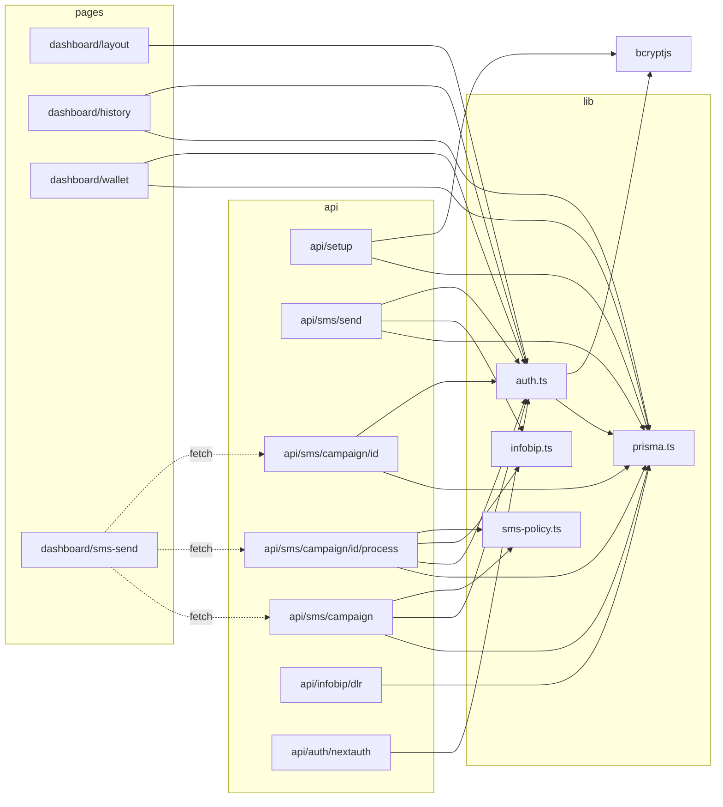

# SovereignSMS 코드베이스 완전 분석

## 1. 프로젝트 개요

| 항목 | 내용 |
|------|------|
| **프로젝트명** | SovereignSMS (Global Mass SMS Platform) |
| **package.json name** | `temp-app` (플레이스홀더, 미변경) |
| **목적** | 한국 시장 대상 대량 SMS 발송 플랫폼 (Infobip 게이트웨이) |
| **디자인 테마** | "Fintech Sovereign" — 다크 슬레이트 + 에메랄드 글래스모피즘 |
| **프레임워크** | Next.js 16.2.3 (App Router, React 19.2.4) |
| **언어** | TypeScript (strict mode) |
| **DB** | PostgreSQL via Prisma 7.7.0 + `@prisma/adapter-pg` |
| **인증** | NextAuth.js 4.24.13 (credentials, JWT) |
| **SMS 프로바이더** | Infobip (`@infobip-api/sdk` 0.3.2) |
| **스타일링** | Vanilla CSS (CSS Variables, 글래스모피즘) — Tailwind 미사용 |
| **애니메이션** | Framer Motion 12.38.0 |
| **React Compiler** | 활성화 (`reactCompiler: true`) |

### 주요 기능
1. **랜딩 페이지** — 히어로 + 피처카드 (Framer Motion 애니메이션)
2. **로그인** — 이메일/비밀번호 credentials 인증
3. **SMS 발송** — 단건 + CSV 대량 (캠페인 기반 배치 처리)
4. **배달 확인** — Infobip DLR 웹훅 수신
5. **발송 이력** — 서버 컴포넌트 테이블 (최근 200건)
6. **지갑/크레딧** — 잔액 조회 + 거래 내역 (충전 기능은 UI만)

---

## 2. 아키텍처 다이어그램

```mermaid
graph TB
    subgraph Client["브라우저 (Client Components)"]
        LP[Landing Page<br/>app/page.tsx]
        LG[Login Page<br/>app/login/page.tsx]
        SMS[SMS Send Page<br/>app/dashboard/sms-send/page.tsx]
        SO[SignOut Button<br/>_components/signout-button.tsx]
    end

    subgraph Server["서버 (Server Components)"]
        DL[Dashboard Layout<br/>app/dashboard/layout.tsx]
        HP[History Page<br/>app/dashboard/history/page.tsx]
        WP[Wallet Page<br/>app/dashboard/wallet/page.tsx]
    end

    subgraph API["API Routes"]
        AUTH[NextAuth Handler<br/>api/auth/[...nextauth]]
        SETUP[Admin Setup<br/>api/setup]
        SEND[SMS Send (Legacy)<br/>api/sms/send]
        CAMP_C[Campaign Create/List<br/>api/sms/campaign]
        CAMP_D[Campaign Detail/Cancel<br/>api/sms/campaign/[id]]
        CAMP_P[Campaign Process<br/>api/sms/campaign/[id]/process]
        DLR[DLR Webhook<br/>api/infobip/dlr]
    end

    subgraph Lib["공유 라이브러리 (lib/)"]
        AUTH_LIB[auth.ts<br/>NextAuth 설정]
        PRISMA_LIB[prisma.ts<br/>Prisma Client]
        INFOBIP_LIB[infobip.ts<br/>Infobip Client]
        POLICY[sms-policy.ts<br/>한국 SMS 정책]
    end

    subgraph External["외부 서비스"]
        INFOBIP_API[Infobip SMS API<br/>w44xx8.api-id.infobip.com]
        PG[(PostgreSQL<br/>localhost:51213)]
    end

    LP --> LG
    LG --> AUTH
    SMS --> CAMP_C
    SMS --> CAMP_P
    SMS --> CAMP_D

    DL --> AUTH_LIB
    HP --> PRISMA_LIB
    WP --> PRISMA_LIB

    AUTH --> AUTH_LIB
    SETUP --> PRISMA_LIB
    SEND --> PRISMA_LIB & INFOBIP_LIB
    CAMP_C --> PRISMA_LIB & POLICY
    CAMP_P --> PRISMA_LIB & INFOBIP_LIB & POLICY
    CAMP_D --> PRISMA_LIB
    DLR --> PRISMA_LIB

    AUTH_LIB --> PRISMA_LIB
    PRISMA_LIB --> PG
    INFOBIP_LIB --> INFOBIP_API
    INFOBIP_API -.->|DLR Webhook| DLR
```

### 레이어 구조

```
┌─────────────────────────────────────────────┐
│  Presentation Layer (Client Components)      │
│  - Landing, Login, SMS Send, SignOut Button  │
├─────────────────────────────────────────────┤
│  Server Components                           │
│  - Dashboard Layout (auth guard)             │
│  - History Page (직접 DB 조회)               │
│  - Wallet Page (직접 DB 조회)                │
├─────────────────────────────────────────────┤
│  API Layer (Route Handlers)                  │
│  - NextAuth, Setup, SMS Send, Campaign CRUD  │
│  - Infobip DLR Webhook                       │
├─────────────────────────────────────────────┤
│  Business Logic (lib/)                       │
│  - sms-policy.ts (한국 SMS 규정)             │
│  - auth.ts (인증 설정)                       │
├─────────────────────────────────────────────┤
│  Data Access (lib/prisma.ts)                 │
│  - Prisma Client + PG Adapter               │
├─────────────────────────────────────────────┤
│  External Services                           │
│  - Infobip SMS API                           │
│  - PostgreSQL (Prisma Postgres)              │
└─────────────────────────────────────────────┘
```

---

## 3. 핵심 파일 맵

### 설정 파일

| 파일 경로 | 역할 | 주요 내용 | 비고 |
|-----------|------|----------|------|
| `package.json` | 프로젝트 메타 + 의존성 | Next.js 16, React 19, Prisma 7, Infobip SDK | name이 `temp-app` |
| `tsconfig.json` | TS 설정 | strict, ES2017, bundler resolution, `@/*` alias | 표준적 |
| `next.config.ts` | Next.js 설정 | `reactCompiler: true`만 설정 | 최소 설정 |
| `prisma.config.ts` | Prisma 설정 | dotenv 로드 + datasource URL | |
| `eslint.config.mjs` | ESLint flat config | next/core-web-vitals + next/typescript | |
| `.env` | 환경변수 | DB URL, Infobip 키, NextAuth 시크릿 | `.gitignore`에 포함 |
| `.gitignore` | Git 제외 목록 | 표준 Next.js + `.env*` + prisma generated | |
| `prisma/schema.prisma` | DB 스키마 | User, SmsCampaign, SmsLog, Transaction (4모델) | |

### 소스 파일

| 파일 경로 | 역할 | 주요 export | 의존 대상 |
|-----------|------|------------|----------|
| **lib/prisma.ts** | Prisma 싱글턴 | `prisma` | `@prisma/client`, `@prisma/adapter-pg`, `pg` |
| **lib/auth.ts** | NextAuth 설정 | `authOptions` | `lib/prisma`, `bcryptjs`, `next-auth` |
| **lib/infobip.ts** | Infobip 클라이언트 | `infobipClient` | `@infobip-api/sdk` |
| **lib/sms-policy.ts** | 한국 SMS 정책 | `KR_POLICY`, `normalizeKrPhone`, `normalizeKrRecipients`, `validateAdMessageRules`, `getRetryDelayMs`, `isTemporaryProviderError` | 없음 (순수 유틸) |
| **types/next-auth.d.ts** | 타입 확장 | `Session.user.id` 추가 | `next-auth` |
| **app/layout.tsx** | 루트 레이아웃 | `RootLayout` (SC) | `globals.css` |
| **app/globals.css** | 디자인 시스템 | CSS Variables, glass-*, btn-primary | - |
| **app/page.tsx** | 랜딩 페이지 | `Home` (CC) | `framer-motion`, `lucide-react` |
| **app/login/page.tsx** | 로그인 | `LoginPage` (CC) | `next-auth/react`, `framer-motion` |
| **app/dashboard/layout.tsx** | 대시보드 레이아웃 | `DashboardLayout` (SC, auth guard) | `lib/auth`, `next-auth`, `lucide-react` |
| **app/dashboard/_components/signout-button.tsx** | 로그아웃 버튼 | `SignOutButton` (CC) | `next-auth/react`, `lucide-react` |
| **app/dashboard/sms-send/page.tsx** | SMS 발송 UI | `SmsSendPage` (CC) | `papaparse`, `lucide-react` |
| **app/dashboard/history/page.tsx** | 발송 이력 | `HistoryPage` (SC) | `lib/auth`, `lib/prisma`, `lucide-react` |
| **app/dashboard/wallet/page.tsx** | 지갑 | `WalletPage` (SC) | `lib/auth`, `lib/prisma`, `lucide-react` |
| **app/api/auth/[...nextauth]/route.ts** | NextAuth 핸들러 | `GET`, `POST` | `lib/auth` |
| **app/api/setup/route.ts** | 관리자 시드 | `GET` | `lib/prisma`, `bcryptjs` |
| **app/api/sms/send/route.ts** | SMS 단순 발송 (레거시) | `POST` | `lib/auth`, `lib/prisma`, `lib/infobip` |
| **app/api/sms/campaign/route.ts** | 캠페인 생성/목록 | `POST`, `GET` | `lib/auth`, `lib/prisma`, `lib/sms-policy` |
| **app/api/sms/campaign/[id]/route.ts** | 캠페인 상세/취소 | `GET`, `POST` | `lib/auth`, `lib/prisma` |
| **app/api/sms/campaign/[id]/process/route.ts** | 캠페인 배치 처리 | `POST` | `lib/auth`, `lib/prisma`, `lib/infobip`, `lib/sms-policy` |
| **app/api/infobip/dlr/route.ts** | DLR 웹훅 | `POST` | `lib/prisma` |
| **scripts/test-infobip.js** | 수동 연결 테스트 | (실행 스크립트) | `@infobip-api/sdk`, `dotenv` |

---

## 4. 데이터 흐름

### A. 인증 흐름

```
LoginPage → signIn('credentials', {email, pw})
  → NextAuth authorize()
    → prisma.user.findUnique(email)
    → bcrypt.compare(pw, hash)
    → JWT 토큰 발급 (session.user.id = token.sub)
  → 성공 시 router.push('/dashboard/sms-send')

Dashboard Layout (서버 컴포넌트)
  → getServerSession(authOptions)
  → 세션 없으면 redirect('/login')
```

### B. SMS 캠페인 발송 흐름 (주요 플로우)

```
[1] 사용자 입력 (SMS Send Page)
  → 수신번호 입력 or CSV 파싱 (PapaParse)
  → 메시지 타입 선택 (TRANSACTIONAL/AD)
  → "Dispatch Campaign" 클릭

[2] 캠페인 생성 (POST /api/sms/campaign)
  → normalizeKrRecipients(): 한국 번호 정규화 (+82)
  → AD 타입 검증: (광고) 접두사 + 무료 수신거부 포함 확인
  → AD 야간 발송 차단 (20:50~08:00 KST)
  → 크레딧 잔액 확인 (estimatedCost = recipients × $0.05)
  → DB 트랜잭션:
    ├── SmsCampaign 생성 (status: QUEUED)
    ├── SmsLog 대량 생성 (recipients × 1건, status: PENDING)
    ├── Transaction 생성 (WITHDRAWAL, -estimatedCost)
    └── User credits 차감

[3] 배치 처리 루프 (클라이언트 폴링)
  → 프론트: processCampaignLoop() — 최대 1000회 반복
  → POST /api/sms/campaign/{id}/process (배치 요청)
    → PENDING/RETRY_PENDING 로그 조회 (effectiveBatchSize건)
    → Infobip SDK로 발송: infobipClient.channels.sms.send()
    → 응답 매핑: responseMessages[i] → pendingLogs[i]
    → 개별 SmsLog 업데이트 (SENT/RETRY_PENDING/FAILED)
    → 동적 배치 사이즈 조절:
      - 성공 시: +20 (최대 200)
      - 실패 시: /2 (최소 20) + 쿨다운 (15초×streak, 최대 120초)
    → 더 이상 PENDING 없으면 → COMPLETED
  → GET /api/sms/campaign/{id}로 진행률 폴링
  → UI에 progress 표시 (processed/total/failed/delivered)

[4] DLR 웹훅 (비동기, Infobip → POST /api/infobip/dlr)
  → messageId로 SmsLog 매칭
  → 상태 업데이트 (DELIVERED/FAILED)
  → SmsCampaign deliveredCount/failedCount 증가
```

### C. 지갑/이력 조회 흐름

```
History Page (서버 컴포넌트)
  → getServerSession() → userId
  → prisma.smsLog.findMany({userId, take: 200, orderBy: createdAt desc})
  → 서버에서 HTML 렌더링 후 전달

Wallet Page (서버 컴포넌트)
  → getServerSession() → userId
  → Promise.all([prisma.user.findUnique, prisma.transaction.findMany])
  → 서버에서 HTML 렌더링 후 전달
```

### D. 외부 API 호출 지점

| 호출 위치 | 대상 API | 메서드 | 용도 |
|-----------|---------|--------|------|
| `api/sms/campaign/[id]/process` | Infobip `channels.sms.send()` | POST | 실제 SMS 발송 |
| `api/sms/send` | Infobip `channels.sms.send()` | POST | 레거시 단순 발송 |
| `scripts/test-infobip.js` | Infobip `/account/1/balance`, `/sms/1/reports` | GET | 수동 테스트 |

---

## 5. 패턴 & 컨벤션

### 네이밍
- **파일**: kebab-case (`sms-send`, `sms-policy`, `signout-button`)
- **변수/함수**: camelCase (`normalizeKrPhone`, `isTemporaryProviderError`)
- **상수**: SCREAMING_SNAKE (`KR_POLICY`, `COST_PER_MESSAGE_USD`, `DEFAULT_BATCH_SIZE`)
- **타입**: PascalCase (`MessageType`, `CampaignProgress`, `CreateCampaignBody`)
- **DB 필드**: camelCase (Prisma 기본)

### 코딩 스타일
- **인라인 스타일 대량 사용**: 모든 컴포넌트가 `style={{}}` 프롭으로 스타일링 (CSS 클래스 최소)
- **글래스 카드 패턴**: `className="glass-card"` + 인라인 스타일 오버라이드
- **CSS Variables**: `--primary`, `--bg-color`, `--surface`, `--border`, `--text-main`, `--text-secondary`
- **서버/클라이언트 분리**: `'use client'` 디렉티브 명시적 사용
- **Server Components**: History, Wallet은 직접 DB 조회 (API 레이어 미경유)

### 디자인 패턴
- **싱글턴 패턴**: `lib/prisma.ts` — `globalForPrisma`로 HMR 시 인스턴스 재사용
- **트랜잭션 패턴**: 캠페인 생성 시 Campaign+SmsLog+Transaction+User credits를 원자적 처리
- **동적 배치 사이즈**: 성공 시 증가, 실패 시 반감 — 적응적 처리율 제어
- **재시도 로직**: 지수적 백오프 (0.5분 → 2분 → 5분), 최대 3회
- **쿨다운 패턴**: 연속 실패 시 쿨다운 시간 증가 (15초 × streak, 최대 120초)

### 에러 핸들링
- **API 라우트**: try-catch 래핑 + `console.error` + `{ error: "..." }` JSON 응답
- **에러 코드**: 401 (미인증), 400 (검증 실패), 402 (크레딧 부족), 404 (미존재), 429 (쿨다운), 502 (Infobip 장애)
- **클라이언트**: `statusError`/`statusMessage` state로 UI 피드백
- **Infobip 장애 시**: 크레딧 차감은 유지, 로그 기록 후 재시도 대기열 이동

### 테스트 패턴
- **테스트 없음** (아래 섹션 7 참조)

---

## 6. 의존성 맵

### 프로덕션 의존성

| 패키지 | 버전 | 용도 | 사용 위치 |
|--------|------|------|----------|
| `next` | 16.2.3 | 프레임워크 | 전체 |
| `react` | 19.2.4 | UI 라이브러리 | 전체 |
| `react-dom` | 19.2.4 | React DOM 렌더러 | 전체 |
| `@prisma/client` | ^7.7.0 | ORM 클라이언트 | `lib/prisma.ts` → API/SC |
| `@prisma/adapter-pg` | ^7.7.0 | Prisma PG 어댑터 | `lib/prisma.ts` |
| `prisma` | ^7.7.0 | Prisma CLI + 엔진 | 스키마 관리 |
| `pg` | ^8.20.0 | PostgreSQL 드라이버 | `lib/prisma.ts` |
| `next-auth` | ^4.24.13 | 인증 | `lib/auth.ts`, Login, API routes |
| `@infobip-api/sdk` | ^0.3.2 | SMS 발송 | `lib/infobip.ts` → API routes |
| `bcryptjs` | ^3.0.3 | 비밀번호 해싱 | `lib/auth.ts`, `api/setup` |
| `framer-motion` | ^12.38.0 | 애니메이션 | Landing, Login |
| `lucide-react` | ^1.7.0 | 아이콘 | 전체 UI |
| `papaparse` | ^5.5.3 | CSV 파싱 | `sms-send/page.tsx` |
| `dotenv` | ^17.4.1 | 환경변수 로드 | `prisma.config.ts`, `test-infobip.js` |
| `recharts` | ^3.8.1 | 차트 | **미사용** (설치만 됨) |
| `zod` | ^4.3.6 | 입력 검증 | **미사용** (설치만 됨) |

### Dev 의존성

| 패키지 | 버전 | 용도 |
|--------|------|------|
| `typescript` | ^5 | 타입 체크 |
| `@types/bcryptjs` | ^2.4.6 | bcryptjs 타입 |
| `@types/node` | ^20 | Node.js 타입 |
| `@types/papaparse` | ^5.5.2 | PapaParse 타입 |
| `@types/pg` | ^8.20.0 | pg 타입 |
| `@types/react` | ^19 | React 타입 |
| `@types/react-dom` | ^19 | ReactDOM 타입 |
| `babel-plugin-react-compiler` | 1.0.0 | React Compiler 플러그인 |
| `eslint` | ^9 | 린터 |
| `eslint-config-next` | 16.2.3 | Next.js ESLint 설정 |

### 내부 모듈 의존 그래프



---

## 7. 테스트 현황

| 항목 | 상태 |
|------|------|
| **테스트 프레임워크** | 없음 (jest/vitest 미설치) |
| **Unit 테스트** | 0건 |
| **Integration 테스트** | 0건 |
| **E2E 테스트** | 0건 (Playwright/Cypress 미설치) |
| **API 테스트** | `scripts/test-infobip.js` (수동 실행, fetch 기반) |
| **CI/CD** | 없음 |
| **테스트 스크립트** | `package.json`에 test 스크립트 없음 |

**테스트 가능 영역 (우선순위)**:
1. `lib/sms-policy.ts` — 순수 함수, 즉시 단위 테스트 가능 (`normalizeKrPhone`, `validateAdMessageRules`)
2. API 라우트 — 통합 테스트 (캠페인 생성→처리 플로우)
3. DLR 웹훅 — 페이로드 파싱 정확성

---

## 8. MCP & 도구 환경

### 현재 설정된 MCP
- **Infobip SMS API**: `@infobip-api/sdk` (SDK로 직접 연동)
- **Prisma Postgres**: 로컬 Prisma Postgres 서버 (localhost:51213)

### 프로젝트에 활용 가능한 MCP/도구
| MCP/도구 | 용도 | 활용 방안 |
|---------|------|----------|
| `context7` | 라이브러리 문서 참조 | Next.js 16, Prisma 7, NextAuth 5 마이그레이션 문서 |
| `supabase` | DB 관리 | 원격 PostgreSQL로 마이그레이션 시 |
| `playwright` | E2E 테스트 | 발송 플로우 자동화 테스트 |
| `chrome-devtools` | UI 디버깅 | 스크린샷 캡처, 퍼포먼스 분석 |

### 활용 가능한 서브에이전트
| 에이전트 | 용도 |
|---------|------|
| `typescript-pro` | TS 코드 품질 개선, Zod 스키마 도입 |
| `security-auditor` | 보안 취약점 감사 |
| `performance-engineer` | API 응답 최적화, 배치 처리 성능 |
| `test-automator` | 테스트 스위트 구축 |
| `frontend-developer` | UI/UX 개선, 반응형 대응 |

---

## 9. 리스크 & 기술 부채

### CRITICAL

| # | 리스크 | 위치 | 설명 |
|---|--------|------|------|
| 1 | **Setup API 보안 취약** | `api/setup/route.ts` | 인증 없이 GET 요청으로 admin 계정 생성. 하드코딩된 비밀번호 `admin123`. 응답에 평문 비밀번호 노출. 프로덕션에서 반드시 제거 또는 환경변수 제한 필요. |
| 2 | **크레딧 환불 로직 부재** | `api/sms/campaign/[id]/route.ts` | 캠페인 취소(CANCELLED) 시 미발송 건의 크레딧을 환불하지 않음. 사용자 크레딧 손실. |
| 3 | **Prisma + pg Pool URL 불일치 가능성** | `lib/prisma.ts` | `DATABASE_URL`이 `prisma+postgres://` 프로토콜인데, `new Pool({ connectionString })` 에 직접 전달. Prisma Postgres 프록시 전용 URL은 네이티브 `pg` Pool에서 작동하지 않을 수 있음. |

### HIGH

| # | 리스크 | 위치 | 설명 |
|---|--------|------|------|
| 4 | **인증 미들웨어 부재** | 전체 API | 각 API 라우트마다 `getServerSession()` 호출. Next.js middleware로 중앙화되지 않아 누락 위험. `api/infobip/dlr`은 `INFOBIP_DLR_SECRET` 미설정 시 인증 없이 접근 가능. |
| 5 | **레이스 컨디션: 크레딧 차감** | `api/sms/campaign/route.ts:65-74` | `user.credits`를 읽은 후 트랜잭션 내에서 차감하지만, `user.credits - estimatedCost`는 읽은 시점의 값 기반. 동시 요청 시 과차감 가능. `{ decrement }` 패턴 + DB-level check 필요. |
| 6 | **모바일 반응형 미구현** | `dashboard/layout.tsx` | 사이드바 `width: 260px` 고정. `@media` 쿼리 없음. 모바일에서 레이아웃 깨짐. |
| 7 | **회원가입 없음** | 전체 | `/api/setup`으로만 사용자 생성 가능. 다중 사용자 운영 불가. |
| 8 | **Infobip 응답 매핑 불확실** | `campaign/[id]/process/route.ts:160-163` | `responseMessages` 배열 추출 시 `infobipResponse.messages` 또는 `infobipResponse.data.messages`로 시도하지만, SDK 응답 구조가 버전에 따라 다를 수 있음. 실제 응답 구조 검증 필요. |

### MEDIUM

| # | 리스크 | 위치 | 설명 |
|---|--------|------|------|
| 9 | **레거시 send API 미완성** | `api/sms/send/route.ts:89` | TODO 주석. Infobip 응답의 messageId를 개별 SmsLog에 매핑하지 않음. DLR 추적 불가. |
| 10 | **바이트 카운트 부정확** | `sms-send/page.tsx:209` | `message.length`로 SMS/LMS 구분 (90바이트 기준)하지만, 실제로는 한글은 2~3바이트. `TextEncoder` 사용 필요. |
| 11 | **인라인 스타일 과다** | 전체 UI | 유지보수 어려움. 테마 변경 시 수십 개 파일 수정 필요. CSS Modules 또는 styled-components 도입 권장. |
| 12 | **하드코딩된 비용** | 여러 곳 | `$0.05`가 `sms-policy.ts`, `sms-send/page.tsx`, `api/sms/send/route.ts`에 각각 하드코딩. 단일 소스 아님. |
| 13 | **네비게이션 링크 미연결** | `app/page.tsx:28-30` | Pricing, API Docs, Dashboard → `<span>` 태그, 라우팅 없음. Sign In 버튼도 href 없음. |
| 14 | **Recharts/Zod 미사용** | `package.json` | 설치되었지만 코드에서 import 없음. 번들 사이즈만 증가. |
| 15 | **Git 커밋 미수행** | 전체 | 초기 커밋 이후 모든 작업 미커밋. 코드 유실 위험. |
| 16 | **사이드바 활성 상태 하드코딩** | `dashboard/layout.tsx:32` | "Send SMS" 링크만 항상 활성 스타일. 현재 경로 기반 동적 활성화 아님. |

### LOW

| # | 리스크 | 위치 | 설명 |
|---|--------|------|------|
| 17 | **rate limiting 없음** | 전체 API | 무제한 요청 가능. DDoS/남용 취약. |
| 18 | **pagination 없음** | History, Campaign list | History는 최근 200건 고정. Campaign은 최근 50건 고정. 페이지네이션/무한 스크롤 없음. |
| 19 | **package name** | `package.json` | `temp-app` — 프로젝트 식별 불가. |
| 20 | **README 미수정** | `README.md` | create-next-app 기본 README 그대로. 프로젝트 설명 없음. |

---

## 10. 변경 영향 분석

**파급 효과 큰 파일/모듈 Top 10**

| 순위 | 파일 | 영향 범위 | 이유 |
|------|------|----------|------|
| 1 | **lib/prisma.ts** | 전체 API + SC | 모든 데이터 접근의 단일 진입점. 변경 시 모든 DB 의존 코드 영향. |
| 2 | **lib/auth.ts** | 로그인 + 전체 대시보드 + 모든 API | 인증 설정 변경 시 세션 구조, JWT, 보호 라우트 전체 영향. |
| 3 | **prisma/schema.prisma** | 전체 데이터 레이어 | 스키마 변경 → 마이그레이션 + 모든 쿼리 코드 수정 필요. |
| 4 | **lib/sms-policy.ts** | 캠페인 생성 + 배치 처리 | 정규화/검증 로직 변경 시 발송 플로우 전체 영향. |
| 5 | **app/globals.css** | 전체 UI | CSS Variables 변경 시 모든 페이지 시각적 영향. |
| 6 | **app/dashboard/layout.tsx** | 대시보드 전체 | 레이아웃/네비게이션 변경 시 하위 모든 페이지 영향. |
| 7 | **api/sms/campaign/route.ts** | SMS 발송 핵심 플로우 | 캠페인 생성 로직 = 크레딧 차감 + SmsLog 생성의 핵심. |
| 8 | **api/sms/campaign/[id]/process/route.ts** | SMS 발송 핵심 플로우 | 실제 Infobip 호출 + 배치/재시도 로직. 가장 복잡한 단일 파일. |
| 9 | **lib/infobip.ts** | SMS 발송 전체 | Infobip 클라이언트 설정 변경 시 발송 기능 전체 영향. |
| 10 | **app/dashboard/sms-send/page.tsx** | 사용자 발송 경험 | 유일한 발송 UI. 변경 시 사용자 워크플로우 직접 영향. 가장 큰 단일 컴포넌트 (272줄). |

---

## 부록: 파일별 코드 줄 수

| 파일 | 줄 수 | 타입 |
|------|-------|------|
| `app/dashboard/sms-send/page.tsx` | 272 | Client Component |
| `api/sms/campaign/[id]/process/route.ts` | 248 | API Route |
| `api/sms/campaign/route.ts` | 165 | API Route |
| `app/page.tsx` | 125 | Client Component |
| `app/dashboard/wallet/page.tsx` | 122 | Server Component |
| `app/login/page.tsx` | 121 | Client Component |
| `api/sms/send/route.ts` | 123 | API Route |
| `app/dashboard/history/page.tsx` | 101 | Server Component |
| `api/sms/campaign/[id]/route.ts` | 101 | API Route |
| `api/infobip/dlr/route.ts` | 92 | API Route |
| `app/globals.css` | 79 | CSS |
| `prisma/schema.prisma` | 85 | Schema |
| `lib/sms-policy.ts` | 72 | Library |
| `app/dashboard/layout.tsx` | 72 | Server Component |
| `lib/auth.ts` | 56 | Library |
| `scripts/test-infobip.js` | 60 | Script |
| `app/api/setup/route.ts` | 36 | API Route |
| `app/dashboard/_components/signout-button.tsx` | 23 | Client Component |
| `app/layout.tsx` | 20 | Server Component |
| `lib/prisma.ts` | 15 | Library |
| `lib/infobip.ts` | 12 | Library |
| `types/next-auth.d.ts` | 10 | Type Definition |
| `api/auth/[...nextauth]/route.ts` | 7 | API Route |
| **총계** | **~2,057줄** | |
